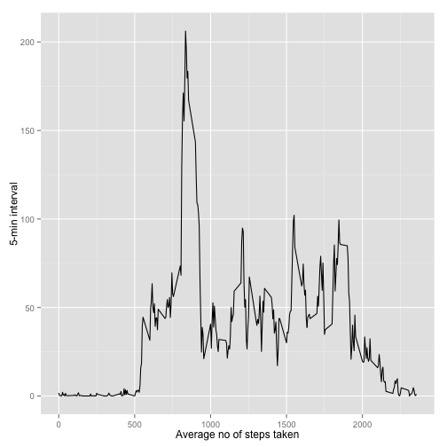
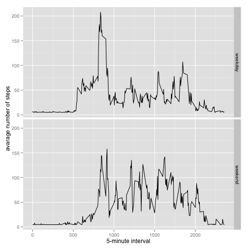

###Loading and preprocessing the data


```r
mainData <- read.csv("activity.csv", sep=",")
head(mainData)
```

```
##   steps       date interval
## 1    NA 2012-10-01        0
## 2    NA 2012-10-01        5
## 3    NA 2012-10-01       10
## 4    NA 2012-10-01       15
## 5    NA 2012-10-01       20
## 6    NA 2012-10-01       25
```

```r
hist(mainData$steps)
```

 

###What is mean total number of steps taken per day?

1. Total number of steps calculated for each day and saved in the variable

```r
stepsPerDay <- tapply(mainData$steps, mainData$date, sum, na.rm=TRUE)
head(stepsPerDay)
```

```
## 2012-10-01 2012-10-02 2012-10-03 2012-10-04 2012-10-05 2012-10-06 
##          0        126      11352      12116      13294      15420
```


2. Histogram of total number of steps taken each day . 


```r
qplot(stepsPerDay, xlab="Total steps for day", ylab="Frequency of steps",  binwidth=1000)
```

 

3. Calculating here the mean and median of total number of steps taken each day.


```r
meanByDay <- mean(stepsPerDay)
medianByDay <- median(stepsPerDay)
```

Mean of total number of steps taken each day is ***9354.2295082***.  
Mean of total number of steps taken each day is ***10395***.

###What is the average daily activity pattern?


```r
averageStepsPerTimeBlock <- aggregate(x=list(meanSteps=mainData$steps), by=list(interval=mainData$interval), FUN=mean, na.rm=TRUE)

head(averageStepsPerTimeBlock)
```

```
##   interval meanSteps
## 1        0 1.7169811
## 2        5 0.3396226
## 3       10 0.1320755
## 4       15 0.1509434
## 5       20 0.0754717
## 6       25 2.0943396
```

1. Make a time series plot


```r
qplot(interval, meanSteps, data=averageStepsPerTimeBlock, geom=c("line"), xlab="Average no of steps taken", ylab="5-min interval")
```

 

2. Which 5-minute interval, on average across all the days in the dataset, contains the maximum number of steps?


```r
mostSteps <- which.max(averageStepsPerTimeBlock$meanSteps)
timeMostSteps <-  gsub("([0-9]{1,2})([0-9]{2})", "\\1:\\2", averageStepsPerTimeBlock[mostSteps,'interval'])
```
Most Steps at: 8:35  

##Imputing missing values

1. Calculate and report the total number of missing values 


```r
missingValues <- length(which(is.na(mainData$steps)))
```

Total number of missing value is ***2304***.

2. Filling in all of the missing values in the dataset. 
3. Create a new dataset that is equal to the original dataset but with the missing data filled in.

   Hmisc package impute function is used here.


```r
dataImputed <- mainData
dataImputed$steps <- impute(mainData$steps, fun=mean)
```

4. Make a histogram of the total number of steps taken.


```r
stepsPerDayImputed <- tapply(dataImputed$steps, dataImputed$date, sum)
qplot(stepsPerDayImputed, xlab='Total steps per day (Imputed)', ylab='Frequency using', binwidth=100)
```

 

 Calculate and report the mean and median
 

```r
stepsPerDayMeanImputed <- mean(stepsPerDayImputed)
stepsPerDayMedianImputed <- median(stepsPerDayImputed)
```

Mean (Imputed): 1.0766189 &times; 10<sup>4</sup>
Median (Imputed): 1.0766189 &times; 10<sup>4</sup>

###Are there differences in activity patterns between weekdays and weekends?

1. Create a new factor variable weekday and weekend


```r
dataImputed$dateType <-  ifelse(as.POSIXlt(dataImputed$date)$wday %in% c(0,6), 'weekend', 'weekday')
```
2. Make a time series plot 


```r
avgdataImputed <- aggregate(steps ~ interval + dateType, data=dataImputed, mean)
ggplot(avgdataImputed, aes(interval, steps)) + 
    geom_line() + 
    facet_grid(dateType ~ .) +
    xlab("5-minute interval") + 
    ylab("avarage number of steps")
```

 
